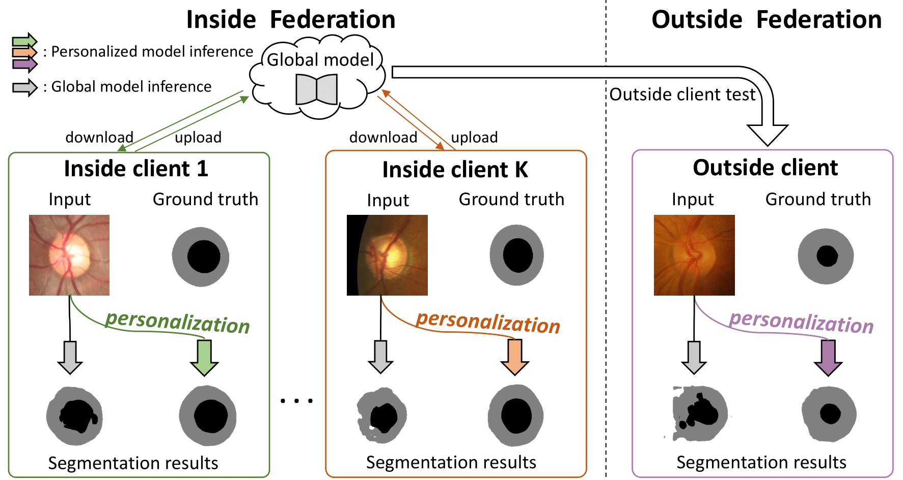

# IOP-FL: Inside-Outside Personalization for Federated Medical Image Segmentation
The is the PyTorch implementation of our paper [IOP-FL: Inside-Outside Personalization for Federated Medical Image Segmentation](https://ieeexplore.ieee.org/abstract/document/10086676) by [Meirui Jiang](https://github.com/MeiruiJiang), [Hongzheng Yang](https://github.com/HongZhengYang), [Cheng Chen](https://cchen-cc.github.io/) and [Qi Dou](http://www.cse.cuhk.edu.hk/~qdou/).

<p align="center">

</p>

## Abstract
> Federated learning (FL) allows multiple medical institutions to collaboratively learn a global model without centralizing client data. It is difficult, if possible at all, for such a global model to commonly achieve optimal performance for each individual client, due to the heterogeneity of medical images from various scanners and patient demographics. This problem becomes even more significant when deploying the global model to unseen clients outside the FL with unseen distributions not presented during federated training. To optimize the prediction accuracy of each individual client for medical imaging tasks, we propose a novel unified framework for both Inside and Outside model Personalization in FL (IOP-FL). Our inside personalization uses a lightweight gradient-based approach that exploits the local adapted model for each client, by accumulating both the global gradients for common knowledge and the local gradients for client-specific optimization. Moreover, and importantly, the obtained local personalized models and the global model can form a diverse and informative routing space to personalize an adapted model for outside FL clients. Hence, we design a new test-time routing scheme using the consistency loss with a shape constraint to dynamically incorporate the models, given the distribution information conveyed by the test data. Our extensive experimental results on two medical image segmentation tasks present significant improvements over SOTA methods on both inside and outside personalization, demonstrating the potential of our IOP-FL scheme for clinical practice.

## Usage
### Setup
**conda**

We recommend using conda to quick setup the environment. Please use the following commands.
```bash
conda env create -f environment.yaml
conda activate iopfl
```

## File structure
`main.py` is the main file to run the federated experiments

`federated` contains federated settings

`snapshots` is the folder containing models for the out-side personalization, we have prepared our trained models, which can be downloaded from [here](https://drive.google.com/file/d/1EnF7MRFE7Ung9sa04SYdbfswUscHkM5h/view?usp=sharing).

`dataset` cotains the dataset which can be downloaded from [here](https://liuquande.github.io/SAML/).

## Preprocess
1. Please first download the dataset and put them under the `dataset/Prostate` and extract.
2. See utils/preprocess.py for the details of data preprocessing. 
    ```bash
    cd utils
    python preprocess.py
    ```
## Run
### Inside federarated training
Please refer to the `inside.sh` for more details.
```bash
# Training on Prostate Dataset using all clients
python main.py --data prostate --source BIDMC ISBI HK UCL I2CVB ISBI_1.5 
```
### Outside federated testing
Please refer to the `outside.sh` for more details.
```bash
# Using existing pretrained models to test on an unseen outside client
python main.py --data prostate --source BIDMC HK I2CVB ISBI_1.5 UCL --target ISBI --ood_test
```


## Citation
If this repository is useful for your research, please cite:
```
@article{jiang2022iopfl,
    author={Jiang, Meirui and Yang, Hongzheng and Cheng, Chen and Dou, Qi},
    journal={IEEE Transactions on Medical Imaging}, 
    title={IOP-FL: Inside-Outside Personalization for Federated Medical Image Segmentation}, 
    year={2023},
    doi={10.1109/TMI.2023.3263072}
}  
```

### Contact
For any questions, please contact 'mrjiang@cse.cuhk.edu.hk' or 'hzyang05@gmail.com'